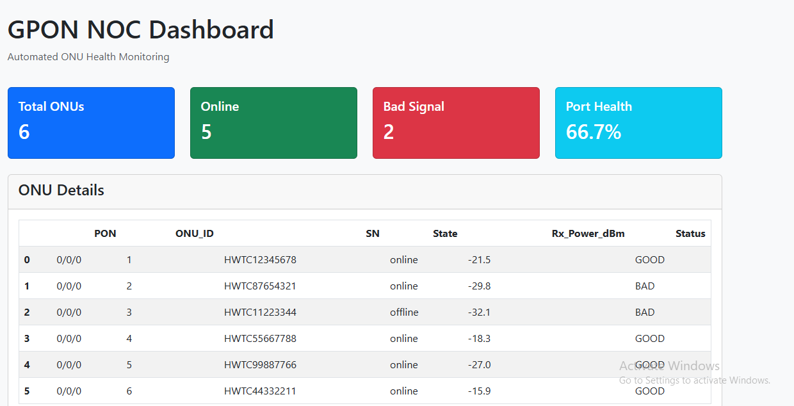

GPON NOC Dashboard
A Python automation tool for GPON Network Operations Center. Parses Huawei OLT CLI output, flags ONUs with bad optical signal, and generates Excel reports for NOC teams.

The Problem I Solved:
NOC engineers manually run `display ont info 0 X Y` on OLT, copy 200+ lines, check Rx power in Excel. Takes 30min per port.

My Solution:
Parse + analyze + report in 10 seconds.

What it does:
Regex Parser: Extracts PON ID, ONU ID, SN, State, Rx Power from raw OLT CLI output
Signal Checker**: Flags BAD signal: `-8 to -27 dBm = GOOD`, `< -27 dBm = BAD` per GPON standards
Health Dashboard**: Web UI shows port health %, online/offline count  
Click Export**: Download Excel report for shift handover
Future upgrade**: Swap `sample_olt_output.txt` with Netmiko SSH module for real OLT access

Tech Stack:
Python, Flask, Pandas, Regex, HTML/CSS

Demo

